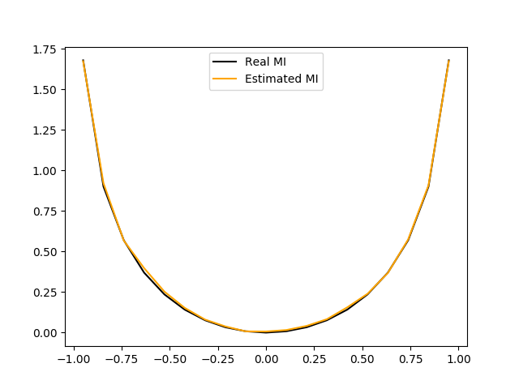
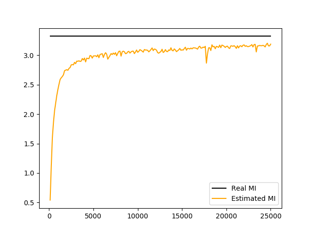

# Mutual Information Neural Estimation (MINE)

This repository contains a PyTorch implementation of [MINE](https://arxiv.org/pdf/1801.04062.pdf). 

## Estimation of the mutual information of two 1-dimensional Gaussians with correlation rho.



## Estimation of the mutual information of MNIST images and their labels.



## General usage

``` 
usage: run.py [-h] [--figs_dir FIGS_DIR] [--n_iterations N_ITERATIONS]
              [--batch_size BATCH_SIZE] [--learning_rate LEARNING_RATE]
              [--n_verbose N_VERBOSE] [--n_window N_WINDOW]
              [--save_progress SAVE_PROGRESS] [--d D] [--n_rhos N_RHOS]
              [--example {Gaussian,MNIST}]

Run the experiments of MINE

optional arguments:
  -h, --help            show this help message and exit
  --figs_dir FIGS_DIR   folder to output the resulting images (default:
                        ../figures/)
  --n_iterations N_ITERATIONS
                        number of training epochs (default: 5000)
  --batch_size BATCH_SIZE
                        mini-batch size for the SGD (default: 128)
  --learning_rate LEARNING_RATE
                        initial learning rate (default: 0.001)
  --n_verbose N_VERBOSE
                        number of iterations for showing the current MI, if
                        -1, then never (default: -1)
  --n_window N_WINDOW   number of iterations taken into consideration for the
                        averaging the MI (moving average) (default: 100)
  --save_progress SAVE_PROGRESS
                        sampling rate of the MI, if -1, nothing is saved
                        (default: -1)
  --d D                 dimensionality of the Gaussians in the example
                        (default: 1)
  --n_rhos N_RHOS       number of rhos for the Gaussian experiment (default:
                        19)
  --example {Gaussian,MNIST}
                        example to run (default: Gaussian)

```